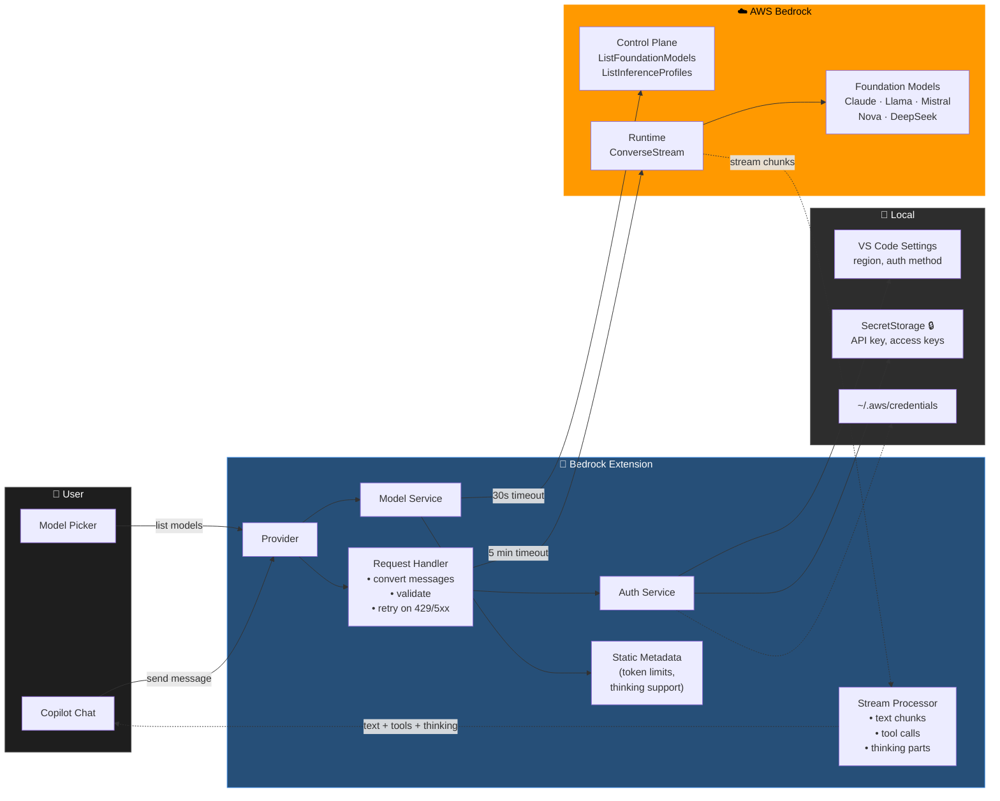

# AWS Bedrock Provider for GitHub Copilot Chat

Integrates AWS Bedrock foundation models into GitHub Copilot Chat for VS Code.


## Architecture



### Data Flow

| Data | Source | Notes |
|---|---|---|
| Model list (names, IDs, modalities) | **Fetched** from AWS `ListFoundationModels` | On each model picker open |
| Token limits & thinking support | **Bundled** static metadata in extension | AWS doesn't expose these via API |
| Cross-region inference profiles | **Fetched** from AWS `ListInferenceProfiles` | Enables multi-region routing |
| Chat responses | **Streamed** from AWS `ConverseStream` | 5 min timeout, 1 retry on transient errors |
| Credentials | **Local** — VS Code SecretStorage or `~/.aws/` | Encrypted, never in `process.env` globally |
| Settings | **Local** — VS Code settings (workspace or user) | Region, auth method, thinking config |

**No third-party calls.** The only outbound traffic goes to AWS Bedrock in your configured region.

## Quick Start

1. Install the extension
2. Open Settings (Cmd/Ctrl + ,) and search for "Bedrock"
3. Configure authentication method and AWS region
4. Select a Bedrock model from the model dropdown in GitHub Copilot Chat

## Authentication Methods

Four authentication methods supported:

### 1. AWS Bedrock API Key (Recommended for Quick Start)
Generate a long-term or short-term API key from the [AWS Console](https://docs.aws.amazon.com/bedrock/latest/userguide/api-keys.html):

- **Long-term keys**: Valid for 1-365 days, easy to generate from AWS Console
- **Short-term keys**: Valid for up to 12 hours, generated via Console or Python package
- Format: `bedrock-api-key-[BASE64]`

Set via Command Palette → "Manage AWS Bedrock Provider" → Set Authentication Method → API Key

### 2. AWS Profile
Use credentials from `~/.aws/credentials` (supports SSO):

```ini
[default]
aws_access_key_id = YOUR_ACCESS_KEY
aws_secret_access_key = YOUR_SECRET_KEY
```

### 3. AWS Access Keys
Direct AWS access key ID and secret (supports session tokens).

### 4. Default Credential Provider Chain
Uses AWS SDK's default credential resolution (environment variables, EC2 instance metadata, etc.)

## Features

- Multi-turn conversations with streaming responses
- Tool/function calling for compatible models
- Vision/image input for compatible models (Claude)
- Extended thinking for compatible models (shows model's reasoning process)
- Cross-region inference profiles for optimized routing
- Automatic retry on transient errors (throttling, network issues)
- Proper cancellation support (aborts in-flight HTTP requests)
- Credentials stored securely via VS Code SecretStorage

## Available Models

The extension exposes all Bedrock foundation models with streaming capabilities:

- **Anthropic**: Claude Opus 4, Sonnet 4, Sonnet 3.7 (thinking), Sonnet 3.5, Haiku 3.5
- **Meta**: Llama 4 Maverick/Scout, Llama 3.x family
- **Mistral**: Large, Small, Mixtral
- **Amazon**: Nova Premier (thinking), Pro, Lite, Micro
- **DeepSeek**: R1 (thinking)
- **Cohere**: Command R+, Command R
- **AI21**: Jamba 1.5

**Extended Thinking**: Models marked with "(thinking)" support extended thinking mode, which shows the model's internal reasoning process. When enabled, temperature is automatically set to 1.0.

## Configuration

### VS Code Settings

Configure via Settings (Cmd/Ctrl + ,) → search "Bedrock":

- **Region**: AWS region for Bedrock services (default: `us-east-1`)
- **Auth Method**: `api-key`, `profile`, `access-keys`, or `default`
- **Profile**: AWS profile name (when using profile method)
- **Enable Extended Thinking**: Show model reasoning process (default: disabled)
- **Thinking Budget Tokens**: Max tokens for thinking (1024-32768, default: 1024)

Sensitive credentials (API keys, access keys) are stored in VS Code's encrypted SecretStorage, not in settings files.

### Commands

- **Manage AWS Bedrock Provider**: Interactive setup for authentication, region, and credentials
- **Configure AWS Bedrock**: Opens VS Code settings filtered to Bedrock configuration

### Model Selection

Model selection is integrated into VS Code's chat interface:
1. Open GitHub Copilot Chat
2. Click the model dropdown at the top of the chat panel
3. Select any available Bedrock model

## Development

```bash
git clone https://github.com/aristide1997/bedrock-vscode-chat
cd bedrock-vscode-chat
npm install
npm run compile
```

Press F5 to launch an Extension Development Host.

Scripts:
- `npm run compile` — Build
- `npm run watch` — Watch mode
- `npm run lint` — Lint
- `npm test` — Run tests

## Limitations

- Some models don't support streaming with tool calls simultaneously
- Rate limits apply based on your AWS account settings
- Token limits for models are bundled as static metadata and updated with extension releases

## Resources

- [AWS Bedrock Documentation](https://docs.aws.amazon.com/bedrock/)
- [AWS Bedrock API Keys](https://docs.aws.amazon.com/bedrock/latest/userguide/api-keys.html)
- [VS Code Chat Provider API](https://code.visualstudio.com/api/extension-guides/ai/language-model-chat-provider)
- [GitHub Repository](https://github.com/aristide1997/bedrock-vscode-chat)

## License

MIT License
