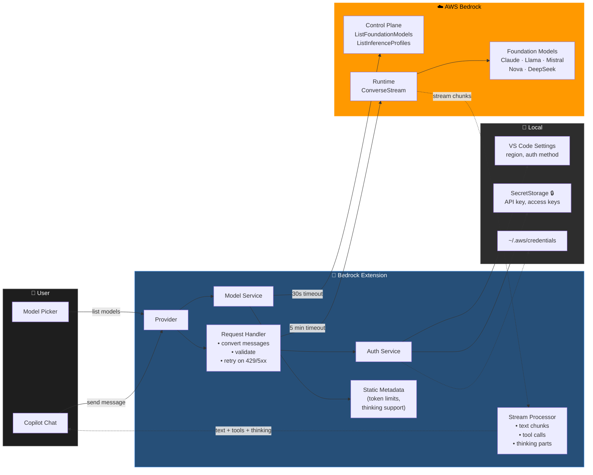

# Architecture

## Overview

The extension registers as a `languageModelChatProvider` in VS Code, bridging GitHub Copilot Chat to AWS Bedrock's ConverseStream API.

## Data Flow

| Data | Source | Notes |
|---|---|---|
| Model list (names, IDs, modalities) | **Fetched** from AWS `ListFoundationModels` | On each model picker open |
| Token limits & thinking support | **Bundled** static metadata in extension | AWS doesn't expose these via API |
| Cross-region inference profiles | **Fetched** from AWS `ListInferenceProfiles` | Enables multi-region routing |
| Chat responses | **Streamed** from AWS `ConverseStream` | 5 min timeout, 1 retry on transient errors |
| Credentials | **Local** — VS Code SecretStorage or `~/.aws/` | Encrypted, never in `process.env` globally |
| Settings | **Local** — VS Code settings (workspace or user) | Region, auth method, thinking config |

## Network & Security

- **No third-party calls.** The only outbound traffic goes to AWS Bedrock in your configured region.
- Credentials are stored in VS Code's encrypted SecretStorage, never in `process.env` globally.
- Bearer tokens for API key auth are scoped to individual SDK calls via try/finally.
- The logger redacts sensitive keys (apiKey, secretAccessKey, token, etc.) from output.

## Streaming & Reliability

- **Timeouts**: 5 min for streaming responses, 30s for control plane calls, 10s for TCP connection.
- **Retry**: One automatic retry on transient errors (HTTP 429, 5xx, ECONNRESET, ETIMEDOUT).
- **Cancellation**: VS Code's CancellationToken is wired to an AbortController that aborts the underlying HTTP request immediately.
- **Client caching**: AWS SDK clients are cached per region and reused across calls for connection pooling.

## Key Files

| File | Purpose |
|---|---|
| `src/extension.ts` | Entry point, provider registration, command registration |
| `src/providers/bedrock-chat.provider.ts` | Main provider that implements `LanguageModelChatProvider` |
| `src/providers/chat-request.handler.ts` | Message conversion, validation, retry, streaming orchestration |
| `src/stream-processor.ts` | Processes ConverseStream events into VS Code progress parts |
| `src/clients/bedrock.client.ts` | AWS SDK wrapper with timeout config and bearer token scoping |
| `src/services/model.service.ts` | Model listing, metadata lookup, inference profile resolution |
| `src/services/authentication.service.ts` | Credential resolution for all 4 auth methods |
| `src/data/model-metadata.ts` | Static model metadata (token limits, thinking support) |
| `src/converters/messages.ts` | VS Code message → Bedrock message format conversion |
| `src/converters/tools.ts` | VS Code tool definitions → Bedrock tool config conversion |
